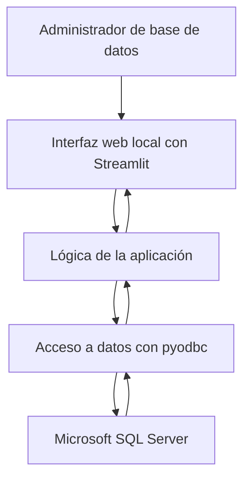

# Arquitectura de la solución

## Descripción general

El proyecto se desarrollará como una aplicación web local para el monitoreo, administración y auditoría de Microsoft SQL Server.

La aplicación utilizará Python y Streamlit para integrar los seis módulos requeridos dentro de una misma interfaz. La información se obtendrá directamente desde SQL Server mediante consultas administrativas y se procesará antes de presentarse mediante indicadores, tablas y gráficos.

## Tecnologías seleccionadas

| Componente | Tecnología | Propósito |
|---|---|---|
| Sistema gestor de bases de datos | Microsoft SQL Server | Plataforma administrada y fuente real de información |
| Lenguaje | Python | Implementación de la aplicación y su lógica |
| Interfaz web local | Streamlit | Navegación, formularios, tablas, indicadores y gráficos |
| Conexión con el SGBD | `pyodbc` | Ejecución de consultas y operaciones sobre SQL Server |
| Visualización | Streamlit y Plotly | Presentación de métricas y gráficos |
| Control de versiones | GitHub | Código, scripts, documentación y evidencias |

## Diagrama general



## Separación de responsabilidades

### Capa de presentación

Será implementada con Streamlit y se encargará de:

- Mostrar el menú principal.
- Permitir la navegación entre los seis módulos.
- Presentar indicadores, tablas, filtros y gráficos.
- Solicitar confirmación antes de ejecutar operaciones administrativas.
- Mostrar mensajes de éxito, advertencia o error.

### Capa de lógica

Se encargará de:

- Procesar los resultados obtenidos de SQL Server.
- Calcular métricas e indicadores.
- Aplicar validaciones.
- Preparar la información antes de mostrarla.
- Controlar las operaciones de mantenimiento.
- Evitar que la interfaz ejecute comandos arbitrarios.

### Capa de acceso a datos

Se encargará de:

- Administrar la conexión con SQL Server.
- Ejecutar consultas administrativas.
- Ejecutar procedimientos u operaciones autorizadas.
- Entregar resultados estructurados a la capa de lógica.
- Capturar errores relacionados con conexión, permisos y ejecución.

### Sistema gestor de bases de datos

Microsoft SQL Server proporcionará:

- Información de la instancia.
- Métricas de rendimiento.
- Información de almacenamiento.
- Historial de respaldos.
- Usuarios, roles y privilegios.
- Operaciones de mantenimiento preventivo.

## Módulos funcionales

La aplicación integrará los siguientes módulos:

1. Estado general de la instancia.
2. Monitoreo de rendimiento.
3. Gestión del almacenamiento.
4. Respaldo y recuperación.
5. Auditoría.
6. Mantenimiento preventivo.

Todos los módulos estarán disponibles desde el menú principal de Streamlit.

## Conexiones y permisos

La solución diferenciará entre:

- Una conexión consultiva con permisos limitados para obtener información administrativa.
- Una conexión administrativa utilizada únicamente para las operaciones de mantenimiento autorizadas.

Las credenciales reales no se almacenarán en el código ni en el repositorio. La configuración utilizará variables de entorno o archivos locales excluidos mediante `.gitignore`.

## Ejecución prevista

La aplicación se iniciará localmente mediante:

```powershell
streamlit run app.py
```

Streamlit iniciará un servidor web local y abrirá la interfaz en el navegador. La aplicación se conectará a la instancia de SQL Server configurada por el usuario.

## Estado de la arquitectura

Esta arquitectura constituye la propuesta inicial del equipo. Podrá ajustarse durante el desarrollo cuando exista una justificación técnica, dejando registro del cambio en la documentación y la bitácora.